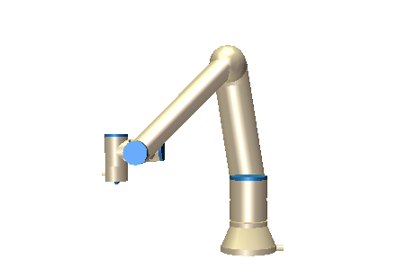
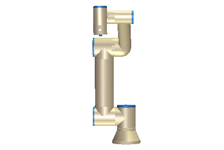

********
Examples
********
This section contains examples of how to use the :ref:`RTDE Control Interface <rtde-control-api>` and the
:ref:`RTDE Receive Interface <rtde-receive-api>`.

.. warning::
   It is your own responsibility to verify that the movements performed by these examples are collision-free and safe
   to execute on the robot. When in doubt use the simulator provided by Universal Robots.

CMake Example
=============
Once you have installed the ur_rtde library. You can use the cmake command find_package() to locate the library.
Here is an example of how to find the library and link it against your C++ executable.

.. code-block:: cmake

   cmake_minimum_required(VERSION 3.5)
   project(ur_rtde_cmake_example)

   find_package(ur_rtde REQUIRED)
   add_executable(ur_rtde_cmake_example main.cpp)
   target_link_libraries(ur_rtde_cmake_example PRIVATE ur_rtde::rtde)

Basic use
=========
Simple example using the RTDE Control Interface to move the robot to a pose with the **moveL** command.

C++:

.. code-block:: c++

   // The constructor simply takes the IP address of the Robot
   RTDEControlInterface rtde_control("127.0.0.1");
   // First argument is the pose 6d vector followed by speed and acceleration
   rtde_control.moveL({-0.143, -0.435, 0.20, -0.001, 3.12, 0.04}, 0.5, 0.2);

Python:

.. code-block:: python

   import rtde_control
   rtde_c = rtde_control.RTDEControlInterface("127.0.0.1")
   rtde_c.moveL([-0.143, -0.435, 0.20, -0.001, 3.12, 0.04], 0.5, 0.3)

Simple example using the RTDE Receive Interface to get the joint positions of the robot

C++:

.. code-block:: c++

   /* The constructor takes the IP address of the robot, by default all variables are
    * transmitted. Optionally only a subset of variables, specified by vector, are transmitted.
    */
   RTDEReceiveInterface rtde_receive("127.0.0.1");
   std::vector<double> joint_positions = rtde_receive.getActualQ();

Python:

.. code-block:: python

   import rtde_receive
   rtde_r = rtde_receive.RTDEReceiveInterface("127.0.0.1")
   actual_q = rtde_r.getActualQ()

.. note::
   When using an e-Series robot data will be received at the maximum available frequency (500Hz), for a CB3
   robot the frequency will be (125Hz).

Forcemode Example
=================
This example will start moving the robot downwards with -20N in the z-axis for 1 second, followed by a move
upwards with 20N in the z-axis for 1 second.

.. code-block:: c++

   #include <rtde_control_interface.h>
   #include <iostream> // only needed for the printout
   #include <thread> // only needed for the delay

   int main(int argc, char* argv[])
   {
      RTDEControlInterface rtde_control("127.0.0.1");
      std::vector<double> task_frame = {0, 0, 0, 0, 0, 0};
      std::vector<int> selection_vector = {0, 0, 1, 0, 0, 0};
      std::vector<double> wrench_down = {0, 0, -20, 0, 0, 0};
      std::vector<double> wrench_up = {0, 0, 20, 0, 0, 0};
      int force_type = 2;
      std::vector<double> limits = {2, 2, 1.5, 1, 1, 1};

      rtde_control.forceModeStart(task_frame, selection_vector, wrench_down, force_type, limits);
      std::cout << std::endl << "Going Down!" << std::endl;
      std::this_thread::sleep_for(std::chrono::seconds(1));
      std::cout << std::endl << "Going Up!" << std::endl << std::endl;
      rtde_control.forceModeUpdate(wrench_up);
      std::this_thread::sleep_for(std::chrono::seconds(1));
      rtde_control.forceModeStop();
   }

Intended movement:

.. image:: ../_static/force_mode_example.gif

ServoJ Example
==============
This example will use the **servoJ** command to move the robot between two joint positions continuously in a
control loop.

.. code-block:: c++

   #include <rtde_control_interface.h>
   #include <thread> // only needed for the delay

   int main(int argc, char* argv[])
   {
      RTDEControlInterface rtde_control("127.0.0.1");
      std::vector<double> joint_q1 = {-1.54, -1.83, -2.28, -0.59, 1.60, 0.023};
      std::vector<double> joint_q2 = {-0.69, -2.37, -1.79, -0.37, 1.93, 0.87};
      double time = 0.3;
      double lookahead_time = 0.1;
      double gain = 300;
      rtde_control.servoJ(joint_q1, velocity, acceleration, time, lookahead_time, gain);
      std::this_thread::sleep_for(std::chrono::milliseconds(280));

      for (unsigned int i=0; i<30; i++)
      {
        rtde_control.servoJ(joint_q1, velocity, acceleration, time, lookahead_time, gain);
        std::this_thread::sleep_for(std::chrono::milliseconds(280));
        rtde_control.servoJ(joint_q2, velocity, acceleration, time, lookahead_time, gain);
        std::this_thread::sleep_for(std::chrono::milliseconds(280));
      }
      rtde_control.servoStop();
   }

.. note::
   To allow for a faster control rate when servoing, the joint positions must be close to each other e.g.
   (dense trajectory).

Intended movement:

.. image:: ../_static/servoj_example.gif

SpeedJ Example
==============
This example will use the **speedJ** command to move the robot with a defined speed for a given time period.

.. code-block:: c++

   #include <rtde_control_interface.h>
   #include <thread> // only needed for the delay

   int main(int argc, char* argv[])
   {
      RTDEControlInterface rtde_control("127.0.0.1");
      std::vector<double> joint_speed = {0.2, 0.3, 0.1, 0.05, 0, 0};
      double time = 0.5;
      double acceleration = 0.5;
      for (unsigned int i=0; i<10; i++)
      {
        rtde_control.speedJ(joint_speed, acceleration, time);
        std::this_thread::sleep_for(std::chrono::milliseconds(200));
      }
      rtde_control.speedStop();
   }

Intended movement:

MoveJ Path With Blending Example
================================
This example will use the **moveJ** command with a path, where each joint pose in the path has a defined velocity, acceleration and blend. The joint poses in the path are defined by a 9-dimensional vector, where the first six values constitutes the joint pose, followed by the last three values *velocity*, *acceleration* and *blend*.

.. code-block:: c++

   #include <rtde_control_interface.h>
   int main(int argc, char* argv[])
   {
     double velocity = 0.8;
     double acceleration = 1.2;
     double blend1 = 0;
     double blend2 = 0.3;
     double blend3 = 0;
     std::vector<std::vector<double>> path;
     std::vector<double> pose1 = {-1.6, -1.8, -2.09, -0.844, 1.59, -0.0255, velocity, acceleration, blend1};
     std::vector<double> pose2 = {-0.738, -1.99, -1.83, -0.894, 1.60, 0.827, velocity, acceleration, blend2};
     std::vector<double> pose3 = {-1.6, -1.63, -1.07, -2.03, 1.59, -0.0202, velocity, acceleration, blend3};
     path.push_back(pose1);
     path.push_back(pose2);
     path.push_back(pose3);
     rtde_control.moveJ(path);
   }

Intended movement:

