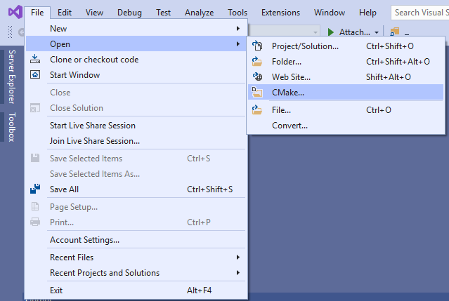

************
Installation
************
This section contains information on how to build and install the ur_rtde library.

Dependencies
============
.. image:: ../_static/boost-logo.svg
  :width: 60
  :target: https://www.boost.org/
  :alt: Boost

.. image:: ../_static/pybind11-logo.png
  :width: 100
  :target: https://github.com/pybind/pybind11
  :alt: pybind11

* `Boost <https://www.boost.org/>`_
* `pybind11 <https://github.com/pybind/pybind11>`_

.. note::
   The pybind11 dependency is optional and are only required if ur_rtde are to be used with Python. The ur_rtde library
   depends on Boost for networking and threading.

You can install Boost on Ubuntu using:

.. code-block:: shell

   sudo apt-get install libboost-all-dev

*Optionally* if you want to use ur_rtde with Python install pybind11 using:

.. code-block:: shell

    git clone --branch v2.2.4 https://github.com/pybind/pybind11.git --depth 1
    cd pybind11
    mkdir build
    cd build
    cmake ..
    make
    sudo make install

.. role:: bash(code)
   :language: bash

.. note::
    For Python 2.x support use :bash:`cmake -DPYBIND11_PYTHON_VERSION=2.x ..` default is Python3

Instructions for Windows
------------------------
Boost precompiled libraries can be found at:
https://sourceforge.net/projects/boost/files/boost-binaries/

.. note::
    If you are using Microsoft Visual Studio make sure you download a version of
    Boost that matches your Microsoft Visual Studio version.

Depending on your setup it may be required to add the Boost library path
to the system environment variables.

Compatible Robots
=================
*  All CB-Series from CB3/CB3.1 software 3.3
*  All e-Series

Compatible Operating Systems
============================
Currently tested on:

*  Ubuntu 16.04 (Xenial Xerus)
*  Ubuntu 18.04 (Bionic Beaver)
*  Windows 10 Pro x64

.. note::
    The ur_rtde should be compatible with Windows 10. However it has currently only
    been tested without python bindings. pybind11 supports
    *Microsoft Visual Studio 2015 Update 3 or newer* on Windows.

Build Instructions
==================
.. code-block:: shell

    git clone https://gitlab.com/sdurobotics/ur_rtde.git
    cd ur_rtde
    mkdir build
    cd build
    cmake ..
    make
    sudo make install

.. note::
    If you want Python 2.x support you must use :bash:`cmake -DPYBIND11_PYTHON_VERSION=2.x ..` in this step also, since the
    default interpreter is Python3. If you do not want to use Python at all, please
    use :bash:`cmake -DPYTHON_BINDINGS:BOOL=OFF ..`

.. tip::
    In order to test the interface, download the most recent UR simulator for your robot from here
    `UR Download <https://www.universal-robots.com/download/>`_. Once installed run the simulator with:
    :bash:`./start-ursim.sh`, when the simulator is running, initialize the robot by first clicking the **'ON'** button,
    and next clicking the **'START'** button. You can now run the examples.

Instructions for Windows
------------------------
.. code-block:: shell

    git clone https://gitlab.com/sdurobotics/ur_rtde.git

If you are using Microsoft Visual Studio version with CMake support (supported since 2017 version).
You should be able to navigate to the folder you cloned the repository to and open the ur_rtde
as a CMake project. See the image below.

You can find more information about CMake projects in visual studio `Here
<https://docs.microsoft.com/en-us/cpp/build/cmake-projects-in-visual-studio?view=vs-2019>`_.

Once you have loaded the project navigate to the CMake Settings through 'Project->CMake Settings for ur_rtde'.
Set the following CMake Command Arguments in order for the project to find Boost and disable the Python bindings:

.. code-block:: shell

    -DBOOST_ROOT=<YOUR_BOOST_ROOT> -DBOOST_LIBRARYDIR=<YOUR_BOOST_LIBRARY_DIR> -DPYTHON_BINDINGS:BOOL=OFF

.. tip::
    Remember you can run the UR Simulator on Windows through the virtual machines provided by UR. In the VMware virtual
    machine you can set the network adapter to "Bridged" in the 'Virtual Machine Settings'. If you then obtain the IP
    address of the robot using ifconfig, you can test the communication with your windows host running the ur_rtde program.

